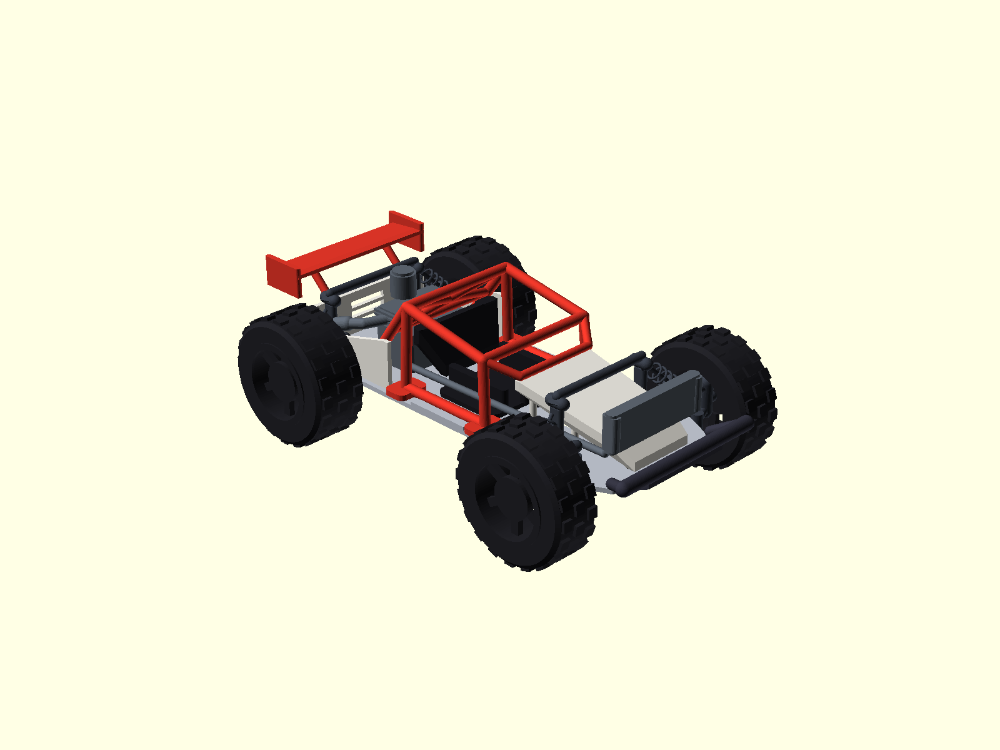

# openscad-cad — CLI 파라메트릭 CAD 스킬 + 검증 예제

 

OpenSCAD CLI로 3D 프린팅용 **조립형 파라메트릭 모델**을 설계·빌드·검증하는
재사용 가능한 ZCode 에이전트 스킬과, 이 스킬로 실제 만든 전체 예제 프로젝트를
담은 저장소입니다.



## 구성

```
openscad-cad/
├── SKILL.md                  ← 에이전트 스킬 본체 (이것만 봐도 워크플로 사용 가능)
├── references/pitfalls.md    ← 실전 함정 카탈로그 20종 (사고→원인→진단→해결)
├── scripts/                  ← 바로 복사해 쓰는 범용 템플릿
│   ├── build.sh              부품/조립 STL + PNG 일괄 생성
│   ├── validate.py           매니폴드 + 부품 간 간섭(정확한 불리언 교집합) 검증
│   └── make_step.py          조립 STL → STEP 변환 (OCP)
├── example/rc_buggy/         ← 검증된 전체 예제: 1:10 RC 오프로드 버기
└── example/real_buggy/        ← 검증된 전체 예제: 1:1 리얼 스케일 버기(함정 10~13 실사례)
    ├── params.scad           모든 치수의 유일한 수정 지점
    ├── lib.scad              공용 프리미티브 (rod/orient/plate/coil/shock)
    ├── parts/                부품 12종 (각각 단독 익스포트 가능)
    ├── assembly.scad         전체 조립 + 컬러
    ├── render/               4방향 조립 + 부품별 렌더링 PNG
    └── README.md             제원/BOM(14부품)/조립 안내
```

## 예제 프로젝트 검증 결과

- 전장 400 / 전폭 250 / 휠베이스 260 / 휠 직경 110 mm, 지상고 50 mm
- **12개 부품 STL 전부 watertight + 와인딩 일관 + 매니폴드 변환 NoError**
- **16개 조립 인스턴스 간 간섭 0 mm³** (manifold3d 정확 불리언 교집합 검사)
- 결합 클리어런스 0.4 mm, 최소 벽 2 mm 이상

STL/STEP은 무거워서 제외 — `scripts/build.sh`와 `scripts/make_step.py`로
몇 분 내 재생성됩니다 (OpenSCAD 2024+ 필요).

## 스킬 설치 (ZCode)

```bash
git clone https://github.com/pinion05/openscad-cad.git
mkdir -p ~/.agents/skills
cp -r openscad-cad ~/.agents/skills/openscad-cad
# SKILL.md의 name(openscad-cad)이 디렉터리명과 일치하면 즉시 디스커버리됨
```

"OpenSCAD로 부품 모델링해줘", "STL 뽑고 간섭 검사해줘" 같은 요청으로 트리거.

## 이 스킬에 박혀 있는 교훈

실제 제작 중 마주친 대표 사고 (전체 목록은 `references/pitfalls.md`):

1. **`use`는 변수를 가져오지 않는다** — params 미 include로 형상이 조용히 붕괴.
   빌드 로그의 "unknown variable" 경고는 실버그다.
2. **실린더 `center=true` 누락** — 림 보어가 한쪽만 파여 너클과 5,400mm³ 충돌.
3. **캡슐 튜브 끝단은 od/2 더 뻗는다** — 부품 경계 클리어런스 가산 필요.
4. **`orient()` 회전 순서** — 외부 Z, 내부 Y만 정답. 틀리면 사용처 전체 오염.
5. **`-D`는 include/use 체인을 못 넘는다** — 전역 해상도는 루트 `$fn` 하나로.
6. **간섭 진단은 교집합 분해로** — 부피 + bbox + 연결 성분 분리가 피처 쌍을
   바로 지목한다. 손계산은 매번 틀린다.

## 환경

- macOS + OpenSCAD(앱 번들 내 CLI), Homebrew Python 3.12 venv
- Python: numpy, trimesh, manifold3d, scipy, networkx, rtree, cadquery(OCP)

## 버전/릴리스 정책 (자동)

- **단일 소스**: `SKILL.md` 프론트매터의 `version` 필드 하나만 고친다.
- 설치된 스킬은 매 실행 시 원격 버전을 자동 체크하고 최신이면 자가 갱신한다
  (SKILL.md "버전 체크" 절).
- CI([version-sync](.github/workflows/version.yml))가 push마다:
  1. `SKILL.md` = `CHANGELOG.md` 최상위 버전 = README 배지 일관성 검사 (불일치 시 실패)
  2. 버전 태그(`vX.Y.Z`)가 없으면 태그 + GitHub Release를 CHANGELOG 해당 섹션 본문으로 자동 생성
