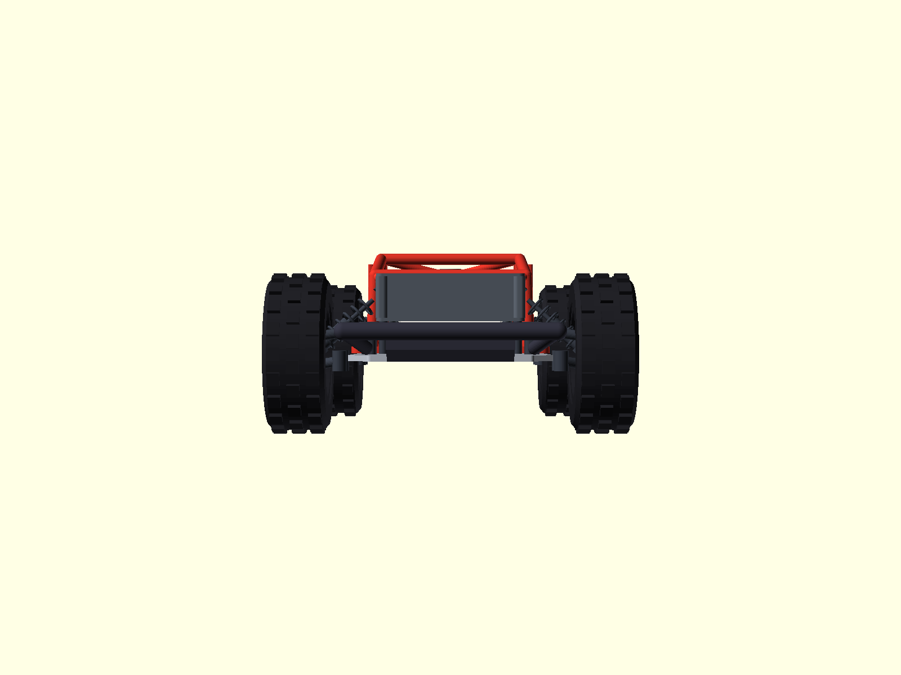
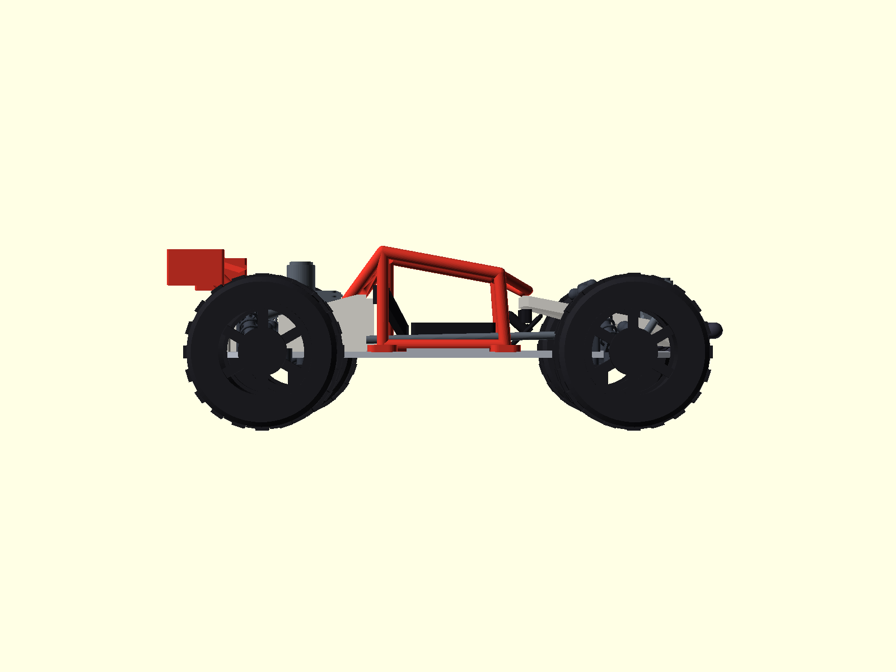
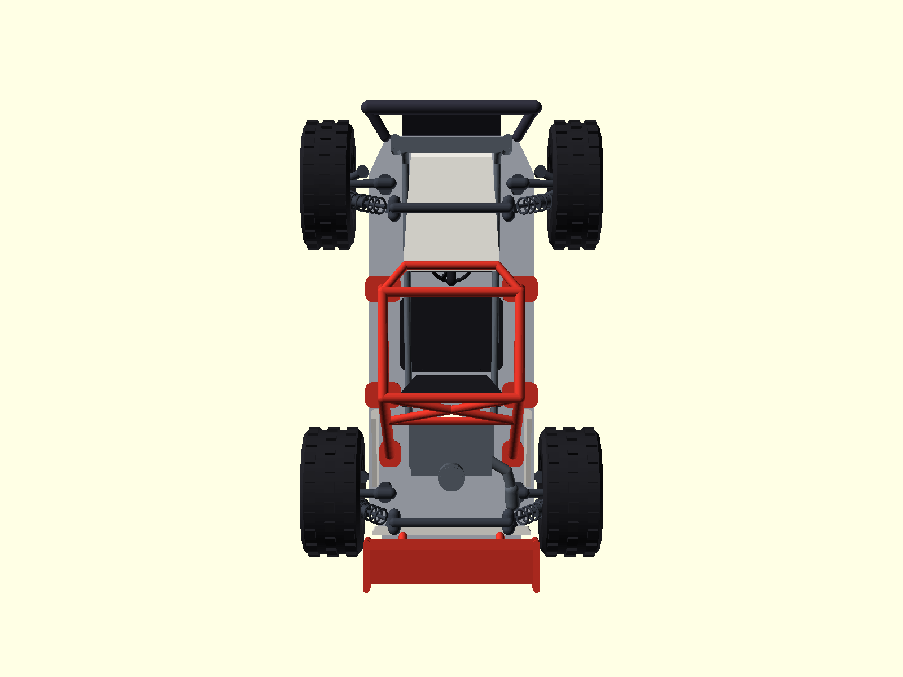

# RC 오프로드 버기 1:10 — 파라메트릭 3D 모델

튜브 프레임 + 오픈 콕핏 형태의 1:10 RC 오프로드 버기(스도버기/샌드레일 스타일)를
OpenSCAD 파라메트릭 스크립트로 제작한 조립형 3D 프린팅 모델입니다.


## 기본 제원

| 항목 | 값 |
|---|---|
| 전장 | 400 mm (스포일러 TE y=-199 ~ 범퍼 FA y=+200) |
| 전폭 | 250 mm (타이어 외측면 기준) |
| 휠베이스 | 260 mm |
| 휠 직경 | 110 mm (트레드 블록 포함, 프런트 폭 42 / 리어 폭 50 — 비대칭) |
| 지상고 | 50 mm (섀시 스키드 기준) |
| 좌표계 | 바닥 z=0, +Z 위, +Y 전진, +X 우측 (단위 mm) |

## 폴더 구조

```
rc_buggy/
├── params.scad          ★ 모든 주요 치수 정의 (여기서 한 곳만 수정)
├── lib.scad             공용 헬퍼 (튜브/판/코일스프링/쇼크/orient)
├── parts/               부품별 파라메트릭 스크립트 (단독 실행·익스포트 가능)
├── assembly.scad        전체 조립 (컬러 배치)
├── stl/                 부품별 STL + 조립 상태 STL
├── step/                조립 상태 STEP
├── render/              부품별 PNG + 조립 4방향 PNG
├── scripts/
│   ├── build.sh         STL 익스포트 + 전체 렌더링 일괄 실행
│   ├── validate.py      매니폴드/와인딩/부피 + 부품 간 간섭 자동 검증
│   └── make_step.py     조립 STL → STEP 변환
└── README.md
```

## 부품 목록 (BOM)

| # | 부품 | 파일 | 수량 | 부피(cm³) | PLA 추정(g)¹ | 비고 |
|---|------|------|:---:|---:|---:|------|
| 01 | 섀시 플레이트 | `01_chassis` | 1 | 183.4 | 228 | 알루미늄 대체 스켈레톤 플레이트, 경량화 홀 3개 |
| 02 | 롤 케이지(6포인트) | `02_rollcage` | 1 | 90.2 | 112 | 프런트/메인 후프 + 리어 스테이 = 마운트 6개, 튜브 Ø9/Ø7 |
| 03 | 프런트 서스펜션 | `03_suspension_front` | 1 | 43.2 | 54 | 더블 위시본 A-arm + 코일오버 쇼크 좌우 2세트 일체 |
| 04 | 리어 서스펜션 | `04_suspension_rear` | 1 | 42.0 | 52 | 동일 구조, 쇼크는 액슬 후방 배치 |
| 05 | 프런트 휠 (타이어+림) | `05_wheel_front` | 2 | 236.7 | 294 | 블록 트레드 타이어 + 딥디시 6스포크 림 일체형 |
| 06 | 리어 휠 (타이어+림) | `06_wheel_rear` | 2 | 279.2 | 346 | 프런트보다 8mm 와이드 |
| 07 | 보닛(프런트 바디) | `07_bonnet` | 1 | 101.7 | 126 | 좁은 쐐기형 노즈, 쇼크 노출 샌드레일 스타일 |
| 08 | 리어 바디 | `08_rear_body` | 1 | 35.2 | 44 | 엔진 베이 사이드 패널 + 벤틸 리어 패널 |
| 09 | 콕핏 (시트/스티어링) | `09_cockpit` | 1 | 81.0 | 100 | 버킷 시트 + 볼스터 + 헤드레스트 + 3스포크 휠 + 대시 |
| 10 | 파워트레인 | `10_drivetrain` | 1 | 178.6 | 221 | 리어 장착 엔진(블록/헤드/핀/배기/에어클리너) + 라디에이터 + 호스 |
| 11 | 프런트 범퍼 | `11_bumper_front` | 1 | 35.0 | 43 | 크로스바 + 브레이스 + 접근각 스카이드 플레이트 |
| 12 | 리어 스포일러 | `12_spoiler` | 1 | 35.2 | 44 | 스트럿 2 + 윙 + 엔드플레이트 |

¹ PLA 밀도 1.24 g/cm³, 100% 솔리드 기준. 실제 infill 20~40% 적용 시 훨씬 가벼워집니다.

합계: 14개 부품(파일 12종), 100% 솔리드 기준 약 1,857 cm³ (PLA 약 2,300 g — 실제 infill 출력 시 훨씬 감소)

## 조립 안내

모든 부품은 차량 좌표계 그대로 출력되므로 **배치 정보가 곧 조립도**입니다.
부품 간 결합 클리어런스는 0.4 mm로 설계되어 있고, 자동 검증으로 부품 간
실체 간섭이 없음을 확인했습니다.

1. **섀시(01)** 를 베이스로 놓습니다.
2. **서스펜션(03/04)** 을 섀시 위에 올립니다 — 어퍼 타워/쇼크 타워 바닥이 섀시 상면(z=54)에, 로어 A-arm 부싱이 섀시 측면에 맞닿습니다. M3 볼트/리벳 가정 위치.
3. **롤 케이지(02)** 의 6개 발판을 섀시 상면에 올려 고정합니다 (프런트 후프 y=+42, 메인 후프 y=-48, 리어 스테이 y=-98).
4. **콕핏(09)** 시트를 섀시 중앙(y=+4)에, **파워트레인(10)** 엔진을 리어(y=-68~-110)에, 라디에이터를 프런트(y=+160)에 배치합니다.
5. **보닛(07)** 을 프런트(y=+58~+168), **리어 바디(08)** 를 엔진 양옆(y=-63~-121)과 후단(y=-161)에 붙입니다.
6. **범퍼(11)** 를 프런트, **스포일러(12)** 를 리어 패널 위(스트럿 y=-163)에 고정합니다.
7. **휠(05/06) 4개**를 너클의 스터브 액슬(Ø9)에 끼웁니다 — 림 보어와 스터브는 맞춤 간극, 접착 또는 M3 세트스크류로 고정.

접착/EPOXY 또는 M2/M3 나사+너트로 체결하는 것을 권장합니다.

## 출력 설정 권장

- 소재: PLA/PETG (튜브 부품은 PETG 권장)
- 레이어 0.15~0.2 mm, 노즐 0.4 mm
- 최소 벽 두께 2 mm 이상으로 설계 (가장 얇은 요소: 윙 플레이트/엔드플레이트 3 mm, 엔진 핀 2 mm)
- 휠은 타이어가 바닥에 닿도록 눕혀 출력 (트레드 블록 품질↑)
- 쇼크 스프링 링(Ø2.0 튜브)은 0.25 노즐 시 품질 향상

## 재현 방법

```bash
# 전체 빌드 (STL + PNG 렌더링)
./scripts/build.sh

# 매니폴드/간섭 검증
.venv/bin/python scripts/validate.py

# 조립 STEP 변환
.venv/bin/python scripts/make_step.py
```

요구사항: OpenSCAD ≥ 2024 (검증: 2026.09.29, /Applications/OpenSCAD.app),
Python 3.12 venv (trimesh·manifold3d·cadquery — `python3.12 -m venv .venv && .venv/bin/pip install numpy trimesh manifold3d scipy networkx rtree cadquery`)

## 치수 수정 방법

`params.scad` 최상단의 값만 바꾸면 전 부품이 연동됩니다.

- `L_total / W_total / WB / wheel_dia` — 차량 기준 치수
- `chassis_z_bot` — 지상고
- `tire_w_f / tire_w_r` — 타이어 폭 (전후 비대칭)
- `tube_od / tube_od_s` — 케이지 튜브 외경
- `gap` — 부품 결합 클리어런스 (기본 0.4 mm)

수정 후 `build.sh` → `validate.py`를 다시 실행해 간섭 0을 확인하세요.

## 품질 검증 결과

- 12개 부품 STL 전부 **watertight + winding 일관 + 매니폴드 변환 NoError**
- 16개 조립 인스턴스(12 부품 + 휠 4개 위치) ** pairwise 교집합 부피 0 mm³ — 간섭 없음**
- 검증 스크립트: `scripts/validate.py` (trimesh + manifold3d 정확 불리언)

## 렌더링

| 정면 | 측면 |
|---|---|
|  |  |

| 상면 | 아이소메트릭 |
|---|---|
|  |  |

부품별 렌더링은 `render/parts/` 참조.
